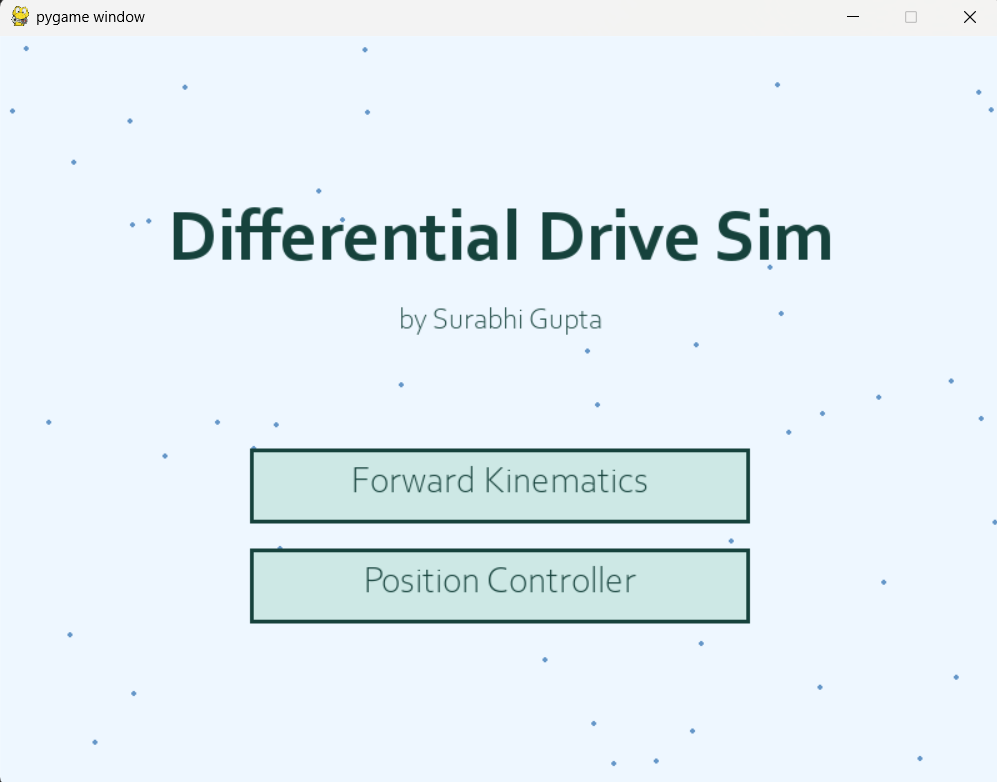

# Differential Drive Sim

This project simulates the forward kinematics and position control using PID of a differential drive robot. The goal was to implement the kinematics from scratch to better understand differential drive mechanics and control systems.


## Features

- Visualization of robot movement and orientation
- Visual representation of wheel rotations and robot orientation
- Speed control with acceleration and deceleration



## Robot Kinematics

### Forward Kinematics

The forward kinematics for a differential drive robot are described by the following equations:

```
dx/dt = v * cos(θ)
dy/dt = v * sin(θ)
dθ/dt = ω

where:
v = (v_right + v_left) / 2
ω = (v_right - v_left) / L

v_right, v_left: velocities of the right and left wheels
L: distance between the wheels (wheel base)
θ: robot's orientation 
```

It takes the initial state of the robot, the wheel velocities and the time step as input to provide the updated robot state as the output. 

### Position Controller
There are two controllers implemented here, one for linear velocity and one for angular velocity. Both use the basic form of a proportional controller:

```
v = Kp * distance_error
ω = Kp_angular * angular_error

where:
Kp, Kp_angular: proportional gains for linear and angular velocity
distance_error: Euclidean distance to the goal position
angular_error: difference between current orientation and desired orientation
```

## Files
`main.py` : Main simulation loop and visualization

`robot_model.py` : Robot kinematics and state update functions

`scenarios.py` : Predefined movement scenarios


## Getting Started

1. Ensure you have Python and Pygame installed.
2. Clone this repository.
3. Run `main.py` to start the simulation.
